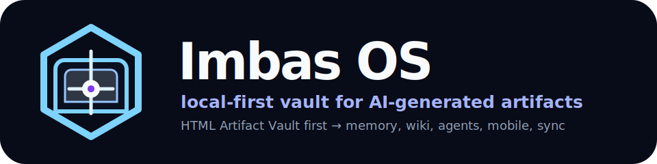
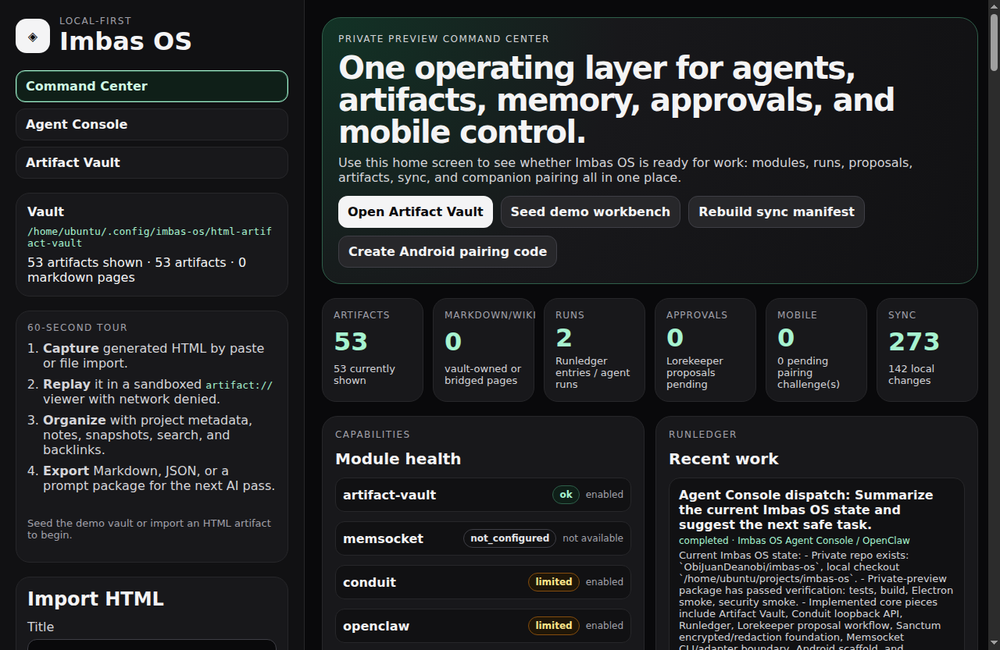
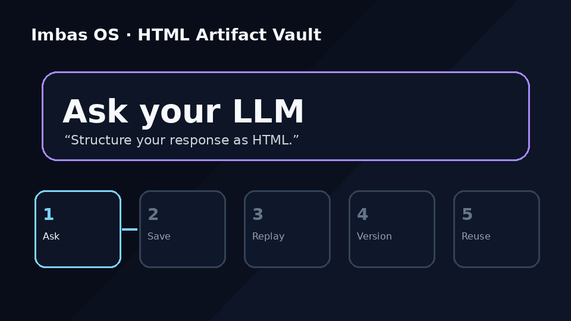

<p align="center">
  
</p>

<p align="center">
  <strong>Save, replay, version, search, and export AI-generated HTML artifacts — locally.</strong>
</p>

<p align="center">
  <a href="docs/roadmap.md">Roadmap</a> ·
  <a href="docs/setup/local-development.md">Local setup</a> ·
  <a href="docs/architecture/dual-surface-information.md">Dual-surface architecture</a> ·
  <a href="llms.txt">llms.txt</a>
</p>





# Imbas OS

**Imbas OS is launching with HTML Artifact Vault first:** a free/open-source local-first desktop workbench for AI-generated HTML artifacts.

Generated HTML is becoming a natural next output layer after raw text and Markdown. Imbas OS gives those artifacts a durable home: sandboxed replay, metadata, notes, provenance, snapshots, search, and AI-context export.

If an LLM gives you an interactive dashboard, mini-tool, slide, simulation, or HTML report, HTML Artifact Vault is the place to keep it instead of losing it in a chat thread or downloads folder.

## What you can do in the alpha

- Paste or import generated HTML and replay it locally.
- Inspect artifacts inside a sandboxed `artifact://` viewer with network access blocked by default.
- Add title/project/tags/prompt/provider metadata, notes, provenance, and trust level.
- Create and restore snapshots as the artifact evolves.
- Search artifact titles, tags, notes, prompts, and visible HTML.
- Export prompt/context packages for the next AI pass.
- Keep vault-owned Markdown notes alongside artifacts, with read-only bridge support for external Markdown/wiki pages.
- Move toward an Obsidian-like human folder tree: folders, nested folders, notes, and readable artifact bundles, while AI agents use stable IDs/indexes underneath.
- Link notes, artifacts, folders, runs, and wiki knowledge with backlinks/graph navigation so everything ties together.
- Treat the wiki as the long-term human-readable knowledge layer, tightly indexed into Memsocket for contextual memory, agentic search, and context packs.

## What this is not yet

- Not a hosted cloud service.
- Not a production signed/notarized installer.
- Not the full Imbas OS 1.0 agent operating layer.
- Not a claim that Android, Memsocket, Conduit, or live agent dispatch are public-stable yet.

## Roadmap

The current plan is to launch **HTML Artifact Vault first** as the free/open-source wedge, then grow into the broader Imbas OS local-first agent workbench. See [`docs/roadmap.md`](docs/roadmap.md) for the canonical roadmap and GitHub milestone plan.

## Current alpha status

This repo is currently an alpha-stage desktop app centered on HTML Artifact Vault. It already includes:

- Electron + React + TypeScript desktop shell.
- Local vault initialization.
- AI-generated HTML artifact import/paste/file import.
- Sandboxed artifact replay through `artifact://`.
- Artifact bundles with metadata, notes, snapshots, provenance, trust levels, and export paths.
- Vault-owned Markdown pages.
- Read-only Markdown/wiki bridge.
- Unified artifact + Markdown search.
- Mixed graph/backlinks and prompt-package export.
- Sync manifest foundation.
- Demo vault with seven artifacts.
- Security smoke test for generated HTML boundaries.

Implemented as alpha foundations, but not production complete yet:

- Memsocket adapter/CLI boundary and optional Conduit write-through; public 1.0 still requires full first-class integration.
- Local Conduit API/loopback service for status, events, runs, artifacts, search, context packs, Lorekeeper proposals/apply, and mobile pairing.
- OpenClaw shadow connector; Hermes/Codex/Claude Code SDKs remain future work.
- Sanctum encrypted local vault, handle/capability validation, redaction, policy-checked resolution, and audit foundations.
- Android Kotlin/Compose companion with live pairing, QR prefill, Keystore-encrypted token storage, scoped reads/actions, diagnostics, Runledger filtering, share-sheet capture, and voice-dictation drafts.
- Local dev-preview tarball/package restore gate; production installer remains future work.

## Quick start

```bash
git clone https://github.com/ObiJuanDeanobi/imbas-os.git
cd imbas-os
npm install
npm run dev
```

For a production-style local run:

```bash
npm run build
npm start
```

## Verify

```bash
npm test
npm run build
npm run smoke
npm run smoke:security
```

Or run the full local preview gate:

```bash
npm run verify
```

Create and verify a private dev preview tarball after the full gate:

```bash
npm run package:dev
```

Check Android companion scaffold files without requiring local Android build tooling:

```bash
npm run android:check
```

This writes `release/imbas-os-dev-preview.tgz` and runs `npm run verify:preview` to check package contents/restorability. It is a local dev-preview package; do not publish package-registry releases or hosted/binary distributions without an explicit release decision.

On headless Linux CI/VPS environments, Electron may require `--no-sandbox` unless the Chromium `chrome-sandbox` helper is root-owned and mode `4755`. The app still configures renderer security controls; the flag is only a host-level smoke-test workaround.

## Docs and AI-readable context

This root `README.md` is the single canonical GitHub entrypoint. It should stay readable by humans and easy for AI systems to parse. Additional files provide structured context rather than competing README variants:

- [`llms.txt`](llms.txt) — concise AI sitemap/context map.
- [`llms-full.txt`](llms-full.txt) — fuller AI context bundle for important pages.
- [`AGENTS.md`](AGENTS.md) — rules, constraints, and workflows for autonomous agents.
- [`skill.md`](skill.md) — actionable task workflows for AI agents.
- [`robots.txt`](robots.txt) — crawler access policy template for website/public-doc deployments.
- [`docs/index.md`](docs/index.md) — documentation library map and 1.0 documentation standard.
- [`docs/setup/local-development.md`](docs/setup/local-development.md) — local setup, run, verification, and troubleshooting.
- [`docs/setup/android-companion.md`](docs/setup/android-companion.md) — APK build/install/pair/diagnostics flow.
- [`docs/how-to/use-imbas-os.md`](docs/how-to/use-imbas-os.md) — day-to-day desktop and companion workflows.
- [`docs/ops/verification.md`](docs/ops/verification.md) — verification gates and live checks.
- [`docs/release/documentation-1.0-gate.md`](docs/release/documentation-1.0-gate.md) — required docs bar before public 1.0.
- [`docs/release/public-alpha-unveil-checklist.md`](docs/release/public-alpha-unveil-checklist.md) — private checklist before making the alpha public.

## Subsystems

```text
Imbas OS
├─ Memsocket        memory + context engine
├─ Artifact Vault   generated artifacts + snapshots
├─ Lorekeeper       living wiki / Markdown knowledge
├─ Conduit          agent connectors / API / MCP / webhooks
├─ Runledger        run history + audit trail
├─ Sanctum          trust, permissions, redaction, approvals, agent secret vault
├─ Atlas            graph + search + navigation
├─ SyncCore         sync, backup, import/export
├─ Desktop          full workbench client
├─ Mobile           Android companion
└─ CLI              terminal + automation interface
```

## Public 1.0 release rule

Before Imbas OS is released publicly as 1.0, **Memsocket must be fully integrated, merged into the Imbas OS release story, and tested as a first-class module**. Users may still choose whether to enable Memsocket at runtime, but public 1.0 should not ship as a loosely related Artifact Vault app plus an external memory repo.

Required before public 1.0:

- Memsocket included in supported install/profile story.
- End-to-end events/search/context-pack flow.
- OpenClaw/Hermes connector dogfood.
- Sanctum redaction/secret-handle safety across memory/context packs.
- MemPalace retired only after the staged migration criteria pass; until then it remains a working safety net, not the public 1.0 memory dependency.
- Documentation readiness gate and fresh-system user experience gate pass: clean OpenClaw config connected to Imbas OS with all supported modules, companion app paired, adapters tested, backup/restore tested, and security smoke verified. See [`docs/release/fresh-system-1.0-gate.md`](docs/release/fresh-system-1.0-gate.md).
- Backup/restore/export/delete/forget behavior tested across memory, artifacts, and wiki.
- Explicit maintainer approval.

## License

Imbas OS is licensed under the [Apache License 2.0](LICENSE).

## Release approval boundary

No package publishing, hosted service, public 1.0 claim, or announcement should happen without explicit maintainer approval. The current public direction is an honest HTML Artifact Vault alpha, not a full Imbas OS 1.0 release.
