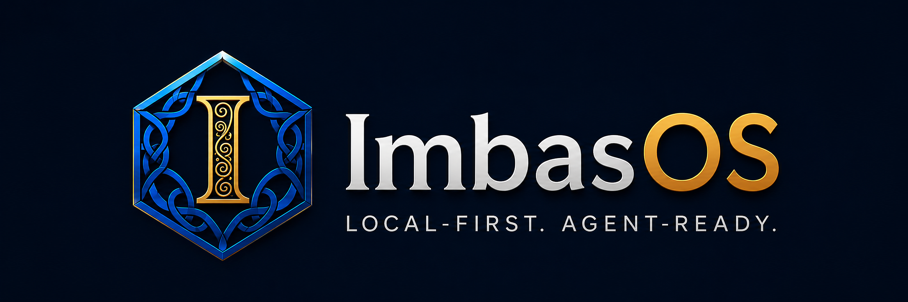

<p align="center">
  
</p>

<p align="center">
  <strong>Save, replay, version, search, and export AI-generated HTML artifacts — locally.</strong>
</p>

<p align="center">
  
  
  
  
</p>

<p align="center">
  <a href="docs/roadmap.md">Roadmap</a> ·
  <a href="docs/setup/local-development.md">Local setup</a> ·
  <a href="docs/architecture/dual-surface-information.md">Dual-surface architecture</a> ·
  <a href="llms.txt">llms.txt</a>
</p>


# Imbas Artifact Vault alpha

**Imbas OS starts with Imbas Artifact Vault:** a local-first desktop vault for AI-generated HTML apps, dashboards, reports, simulations, slides, calculators, and mini-tools.

**Chats are temporary. Artifacts should be durable.** Instead of losing generated HTML in chat threads, random downloads, or one-off folders, save it into a vault with sandboxed replay, metadata, notes, provenance, snapshots, search, backlinks, and AI-context export.

The bigger Imbas OS vision is a local-first agent workbench, but this public alpha is intentionally focused on one useful thing: making AI artifacts durable, inspectable, replayable, and reusable.

## What you can use today

- Paste or import generated HTML and replay it locally.
- Inspect artifacts inside a sandboxed `artifact://` viewer with network access blocked by default.
- Add title/project/tags/prompt/provider metadata, notes, provenance, and trust level.
- Create and restore snapshots as the artifact evolves.
- Search artifact titles, tags, notes, prompts, and visible HTML.
- Copy/export AI context packages for the next AI pass.
- Keep vault-owned Markdown notes alongside artifacts, with read-only bridge support for external Markdown/wiki pages.
- Use current graph/backlink foundations across artifacts and Markdown pages.

HTML Artifact Vault is useful when an AI model gives you:

- an interactive dashboard;
- a single-file web app or prototype;
- a simulation or visual explainer;
- a report or slide-style presentation;
- a calculator or internal tool;
- a compliance/evidence pack;
- a project artifact you want to continue with another model.

## Quick start

```bash
git clone https://github.com/ObiJuanDeanobi/imbas-os.git
cd imbas-os
npm install
npm run dev
```

For a production-style local run:

```bash
npm run build
npm start
```

After launch:

1. Click **Seed demo vault** or import/paste an HTML file.
2. Open an artifact in the sandboxed preview.
3. Add notes, tags, provenance, and trust metadata.
4. Create a snapshot before changing the artifact.
5. Copy an AI context package for the next model pass.

## Alpha limitations

- Source build only; no signed/notarized installer yet.
- The desktop Artifact Vault is the supported public surface.
- Android, Conduit, Memsocket, Sanctum, OpenClaw dispatch, and live agent workflows are private-preview foundations, not stable public APIs.
- Do not store secrets or sensitive credentials in artifacts, notes, context packs, demo data, wiki pages, or Runledger entries.
- `package.json` is intentionally marked `private: true` until the project has an approved package/distribution plan.

## Security model

Replaying generated HTML is the core risk, so Artifact Vault treats artifacts like hostile documents by default.

Current alpha boundaries:

- artifact replay uses a sandboxed `artifact://` viewer;
- artifact-origin network requests are blocked by default;
- the Electron shell uses `nodeIntegration: false`, `contextIsolation: true`, and `sandbox: true`;
- the custom `artifact` protocol is registered as a secure standard scheme before app ready;
- artifact permission requests, popup windows, and artifact-initiated top-level navigation are denied;
- artifacts do not get Node/system/filesystem access;
- artifacts do not get direct access to the app shell bridge;
- imported artifacts start as `untrusted`;
- security smoke tests cover generated HTML boundaries.

Future controls such as explicit network permission or trusted-artifact capabilities should stay opt-in, visible, and auditable. See [`SECURITY.md`](SECURITY.md) and [`docs/threat-model.md`](docs/threat-model.md).

## Core concepts

- **Artifact** — a generated HTML output saved as a durable local object.
- **Vault** — the local filesystem store for artifacts, notes, snapshots, indexes, and exports.
- **Snapshot** — a version checkpoint for artifact HTML and metadata; restore remains reversible.
- **Provenance** — source type, source path when known, prompt, provider/model, hash, and capture history.
- **Trust level** — imported artifacts start as `untrusted`; trust should be earned locally through review.
- **AI context package** — a Markdown handoff containing metadata, notes, provenance, visible text, snapshot history, and fenced HTML for the next AI pass.
- **Wiki bridge** — optional Markdown/wiki indexing so artifacts can connect to project notes and backlinks.

## File and bundle format

The current alpha stores source-of-truth bundles as local folders under the vault:

```text
vault-root/
  artifacts/
    <artifact-id>/
      artifact.html
      metadata.json
      notes.md
      snapshots/
        <timestamp>.html
        <timestamp>.json
```

The public product direction is a more human-readable `.artifact/` bundle shape that can live naturally in an Obsidian-like folder tree, for example:

```text
my-dashboard.artifact/
  artifact.html
  metadata.json
  notes.md
  provenance.md
  snapshots/
  context/
    ai-context.md
```

Stable IDs and indexes remain available for agents/search/sync, but the human-facing vault should stay plain-file, Git-friendly, backup-friendly, and easy to inspect. See [`docs/file-format.md`](docs/file-format.md).

## Verify

```bash
npm test
npm run build
npm run smoke
npm run smoke:security
```

Or run the full local preview gate:

```bash
npm run verify
```

Create and verify a local dev preview tarball after the full gate:

```bash
npm run package:dev
```

Check Android companion scaffold files without requiring local Android build tooling:

```bash
npm run android:check
```

This writes `release/imbas-os-dev-preview.tgz` and runs `npm run verify:preview` to check package contents/restorability. It is a local dev-preview package; do not publish package-registry releases or hosted/binary distributions without an explicit release decision.

On headless Linux CI/VPS environments, Electron may require `--no-sandbox` unless the Chromium `chrome-sandbox` helper is root-owned and mode `4755`. The app still configures renderer security controls; the flag is only a host-level smoke-test workaround.

## Roadmap

The launch path is deliberately layered:

```text
Artifact Vault
→ Knowledge Vault
→ Agent Workbench
→ Imbas OS
```

1. **Imbas Artifact Vault / HTML Artifact Vault alpha** — save/import generated HTML, replay it safely, edit metadata/notes/provenance, snapshot versions, search, and export/copy AI context.
2. **Knowledge Vault** — make the vault feel daily-useful with human-readable folders, `.artifact/` bundles, richer graph/backlink polish, unresolved-link workflows, and better Markdown/wiki flows.
3. **Agent Workbench** — connect context packs, local APIs, run history, memory/search, reviewed wiki updates, mobile capture, and agent dispatch behind stable safety boundaries.
4. **Imbas OS public 1.0** — ship the broader local-first agent workbench only after fresh-system, docs, security/privacy, backup/restore/delete/forget, and Memsocket first-class integration gates pass.

For the detailed milestone plan, see [`docs/roadmap.md`](docs/roadmap.md). For the operator checklist to get the alpha across the finish line, see [`docs/release/html-artifact-vault-alpha-finish-line.md`](docs/release/html-artifact-vault-alpha-finish-line.md).

## Larger Imbas OS vision

The broader Imbas OS roadmap includes local memory, agent run history, context APIs, mobile capture, reviewed wiki updates, approvals, and agent dispatch. Those pieces are intentionally lower in this README until the Artifact Vault wedge is useful on its own.

| State | Status |
|---|---|
| Imbas Artifact Vault alpha | Public alpha: focused local desktop vault for generated HTML artifacts. |
| Imbas OS private preview | Integration lane for Conduit, Runledger, Lorekeeper, Sanctum, Android, Memsocket, and OpenClaw dispatch. |
| Imbas OS public 1.0 | Blocked until fresh-system, docs, security/privacy, backup/restore/delete/forget, and Memsocket first-class integration gates pass. |

Detailed subsystem map: [`docs/architecture/subsystems.md`](docs/architecture/subsystems.md).

## Docs and AI-readable context

This root `README.md` is the single canonical GitHub entrypoint. It should stay readable by humans and easy for AI systems to parse. Additional files provide structured context rather than competing README variants:

- [`llms.txt`](llms.txt) — concise AI sitemap/context map.
- [`llms-full.txt`](llms-full.txt) — fuller AI context bundle for important pages.
- [`AGENTS.md`](AGENTS.md) — rules, constraints, and workflows for autonomous agents.
- [`skill.md`](skill.md) — actionable task workflows for AI agents.
- [`robots.txt`](robots.txt) — crawler access policy template for website/public-doc deployments.
- [`docs/index.md`](docs/index.md) — documentation library map and 1.0 documentation standard.
- [`docs/setup/local-development.md`](docs/setup/local-development.md) — local setup, run, verification, and troubleshooting.
- [`docs/setup/android-companion.md`](docs/setup/android-companion.md) — APK build/install/pair/diagnostics flow.
- [`docs/how-to/use-artifact-vault.md`](docs/how-to/use-artifact-vault.md) — public Artifact Vault alpha workflow.
- [`docs/private-preview/use-full-imbas-os.md`](docs/private-preview/use-full-imbas-os.md) — broader private-preview Imbas OS desktop/mobile workflows.
- [`docs/ops/verification.md`](docs/ops/verification.md) — verification gates and live checks.
- [`docs/release/documentation-1.0-gate.md`](docs/release/documentation-1.0-gate.md) — required docs bar before public 1.0.
- [`docs/release/public-alpha-unveil-checklist.md`](docs/release/public-alpha-unveil-checklist.md) — final public-alpha presentation checklist.

## License

Imbas OS is licensed under the [Apache License 2.0](LICENSE).

## Release approval boundary

No package publishing, hosted service, public 1.0 claim, or announcement should happen without explicit maintainer approval. The current public direction is an honest HTML Artifact Vault alpha, not a full Imbas OS 1.0 release.
