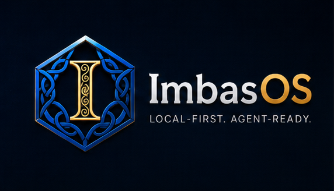
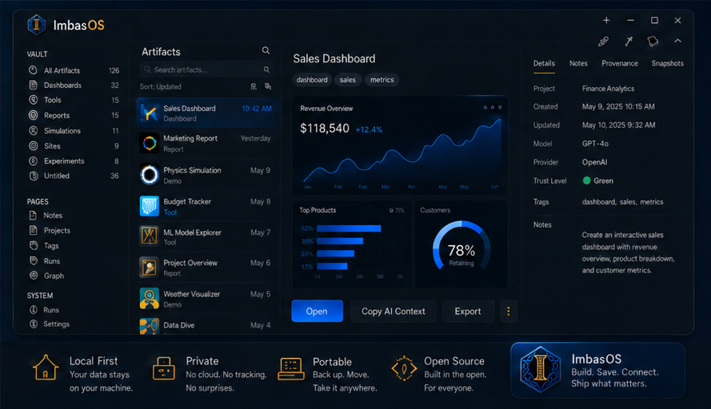
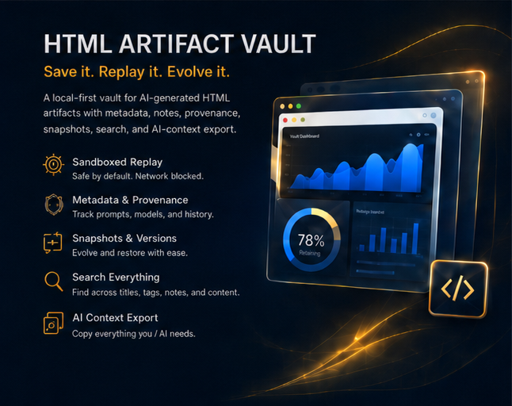

<p align="center">
  
</p>

<p align="center">
  <strong>Save, replay, version, search, and export AI-generated HTML artifacts — locally.</strong>
</p>

<p align="center">
  <a href="docs/roadmap.md">Roadmap</a> ·
  <a href="docs/setup/local-development.md">Local setup</a> ·
  <a href="docs/architecture/dual-surface-information.md">Dual-surface architecture</a> ·
  <a href="llms.txt">llms.txt</a>
</p>





# Imbas OS

**Imbas OS starts with Imbas Artifact Vault:** a local-first desktop vault for AI-generated HTML apps, dashboards, reports, simulations, slides, calculators, and mini-tools.

**Chats are temporary. Artifacts should be durable.** Instead of losing generated HTML in chat threads, random downloads, or one-off folders, save it into a vault with sandboxed replay, metadata, notes, provenance, snapshots, search, backlinks, and AI-context export.

The bigger Imbas OS vision is a local-first agent workbench, but the public alpha is intentionally focused on one useful thing: making AI artifacts durable, inspectable, replayable, and reusable.

## Why this exists

AI models increasingly produce interactive HTML: dashboards, visual explainers, slide decks, simulations, calculators, internal tools, reports, prototypes, and compliance/evidence views. Those outputs are useful, but they are usually treated as disposable chat attachments.

Imbas Artifact Vault turns those outputs into durable project objects:

- saved as local files you can back up and inspect;
- replayed in a hostile-document sandbox;
- annotated with notes, prompt, provider/model, tags, project, trust level, and provenance;
- snapshotted as they evolve;
- searchable later;
- exportable as AI context for the next model pass.

## What you can use today

- Paste or import generated HTML and replay it locally.
- Inspect artifacts inside a sandboxed `artifact://` viewer with network access blocked by default.
- Add title/project/tags/prompt/provider metadata, notes, provenance, and trust level.
- Create and restore snapshots as the artifact evolves.
- Search artifact titles, tags, notes, prompts, and visible HTML.
- Copy/export AI context packages for the next AI pass.
- Keep vault-owned Markdown notes alongside artifacts, with read-only bridge support for external Markdown/wiki pages.
- Use current graph/backlink foundations across artifacts and Markdown pages.

HTML Artifact Vault is useful when an AI model gives you:

- an interactive dashboard;
- a single-file web app or prototype;
- a simulation or visual explainer;
- a report or slide-style presentation;
- a calculator or internal tool;
- a compliance/evidence pack;
- a project artifact you want to continue with another model.

## Core concepts

- **Artifact** — a generated HTML output saved as a durable local object.
- **Vault** — the local filesystem store for artifacts, notes, snapshots, indexes, and exports.
- **Snapshot** — a version checkpoint for artifact HTML and metadata; restore remains reversible.
- **Provenance** — source type, source path when known, prompt, provider/model, hash, and capture history.
- **Trust level** — imported artifacts start as `untrusted`; trust should be earned locally through review.
- **AI context package** — a Markdown handoff containing metadata, notes, provenance, visible text, snapshot history, and fenced HTML for the next AI pass.
- **Wiki bridge** — optional Markdown/wiki indexing so artifacts can connect to project notes and backlinks.

## Security model

Replaying generated HTML is the core risk, so Artifact Vault treats artifacts like hostile documents by default.

Current alpha boundaries:

- artifact replay uses a sandboxed `artifact://` viewer;
- artifact-origin network requests are blocked by default;
- the Electron shell uses `nodeIntegration: false`, `contextIsolation: true`, and `sandbox: true`;
- artifacts do not get Node/system/filesystem access;
- artifacts do not get direct access to the app shell bridge;
- imported artifacts start as `untrusted`;
- security smoke tests cover generated HTML boundaries.

Future controls such as explicit network permission or trusted-artifact capabilities should stay opt-in, visible, and auditable.

## File and bundle format

The current alpha stores source-of-truth bundles as local folders under the vault:

```text
vault-root/
  artifacts/
    <artifact-id>/
      artifact.html
      metadata.json
      notes.md
      snapshots/
        <timestamp>.html
        <timestamp>.json
```

The public product direction is a more human-readable `.artifact/` bundle shape that can live naturally in an Obsidian-like folder tree, for example:

```text
my-dashboard.artifact/
  artifact.html
  metadata.json
  notes.md
  provenance.md
  snapshots/
  context/
    ai-context.md
```

Stable IDs and indexes remain available for agents/search/sync, but the human-facing vault should stay plain-file, Git-friendly, backup-friendly, and easy to inspect. See [`docs/file-format.md`](docs/file-format.md).

## Roadmap

The launch path is deliberately layered:

```text
Artifact Vault
→ Knowledge Vault
→ Agent Workbench
→ Imbas OS
```

1. **Imbas Artifact Vault / HTML Artifact Vault alpha** — save/import generated HTML, replay it safely, edit metadata/notes/provenance, snapshot versions, search, and export/copy AI context.
2. **Knowledge Vault** — make the vault feel daily-useful with human-readable folders, `.artifact/` bundles, richer graph/backlink polish, unresolved-link workflows, and better Markdown/wiki flows.
3. **Agent Workbench** — connect context packs, local APIs, run history, memory/search, reviewed wiki updates, mobile capture, and agent dispatch behind stable safety boundaries.
4. **Imbas OS public 1.0** — ship the broader local-first agent workbench only after fresh-system, docs, security/privacy, backup/restore/delete/forget, and Memsocket first-class integration gates pass.

For the detailed milestone plan, see [`docs/roadmap.md`](docs/roadmap.md). For the operator checklist to get the alpha across the finish line, see [`docs/release/html-artifact-vault-alpha-finish-line.md`](docs/release/html-artifact-vault-alpha-finish-line.md).

| State | Status |
|---|---|
| Imbas Artifact Vault alpha | Public target after approval: focused local desktop vault for generated HTML artifacts. |
| Imbas OS private preview | Integration lane for Conduit, Runledger, Lorekeeper, Sanctum, Android, Memsocket, and OpenClaw dispatch. |
| Imbas OS public 1.0 | Blocked until fresh-system, docs, security/privacy, backup/restore/delete/forget, and Memsocket first-class integration gates pass. |

## What this is not yet

- Not a hosted cloud service.
- Not a production signed/notarized installer.
- Not the full Imbas OS 1.0 agent operating layer.
- Not a claim that Android, Memsocket, Conduit, Runledger, Lorekeeper, Sanctum, or live agent dispatch are public-stable yet.

The larger Imbas OS roadmap includes local memory, agent run history, context APIs, mobile capture, reviewed wiki updates, approvals, and agent dispatch. Those pieces are intentionally lower in the README until the artifact vault wedge is useful on its own.

## Current alpha status

This repo is currently an alpha-stage desktop app centered on Imbas Artifact Vault. It already includes:

- Electron + React + TypeScript desktop shell.
- Local vault initialization.
- AI-generated HTML artifact import/paste/file import.
- Sandboxed artifact replay through `artifact://`.
- Artifact bundles with metadata, notes, snapshots, provenance, trust levels, and export paths.
- Vault-owned Markdown pages.
- Read-only Markdown/wiki bridge.
- Unified artifact + Markdown search.
- Mixed graph/backlinks and AI-context export.
- Sync manifest foundation.
- Demo vault with seven artifacts.
- Security smoke test for generated HTML boundaries.

Implemented as private-preview foundations, but not public-stable yet:

- Memsocket adapter/CLI boundary and optional Conduit write-through; public 1.0 still requires full first-class integration.
- Local Conduit API/loopback service for status, events, runs, artifacts, search, context packs, Lorekeeper proposals/apply, and mobile pairing.
- OpenClaw shadow connector; Hermes/Codex/Claude Code SDKs remain future work.
- Sanctum encrypted local vault, handle/capability validation, redaction, policy-checked resolution, and audit foundations.
- Android Kotlin/Compose companion with live pairing, QR prefill, Keystore-encrypted token storage, scoped reads/actions, diagnostics, Runledger filtering, share-sheet capture, and voice-dictation drafts.
- Local dev-preview tarball/package restore gate; production installer remains future work.

## Quick start

```bash
git clone https://github.com/ObiJuanDeanobi/imbas-os.git
cd imbas-os
npm install
npm run dev
```

For a production-style local run:

```bash
npm run build
npm start
```

## Verify

```bash
npm test
npm run build
npm run smoke
npm run smoke:security
```

Or run the full local preview gate:

```bash
npm run verify
```

Create and verify a private dev preview tarball after the full gate:

```bash
npm run package:dev
```

Check Android companion scaffold files without requiring local Android build tooling:

```bash
npm run android:check
```

This writes `release/imbas-os-dev-preview.tgz` and runs `npm run verify:preview` to check package contents/restorability. It is a local dev-preview package; do not publish package-registry releases or hosted/binary distributions without an explicit release decision.

On headless Linux CI/VPS environments, Electron may require `--no-sandbox` unless the Chromium `chrome-sandbox` helper is root-owned and mode `4755`. The app still configures renderer security controls; the flag is only a host-level smoke-test workaround.

## Docs and AI-readable context

This root `README.md` is the single canonical GitHub entrypoint. It should stay readable by humans and easy for AI systems to parse. Additional files provide structured context rather than competing README variants:

- [`llms.txt`](llms.txt) — concise AI sitemap/context map.
- [`llms-full.txt`](llms-full.txt) — fuller AI context bundle for important pages.
- [`AGENTS.md`](AGENTS.md) — rules, constraints, and workflows for autonomous agents.
- [`skill.md`](skill.md) — actionable task workflows for AI agents.
- [`robots.txt`](robots.txt) — crawler access policy template for website/public-doc deployments.
- [`docs/index.md`](docs/index.md) — documentation library map and 1.0 documentation standard.
- [`docs/setup/local-development.md`](docs/setup/local-development.md) — local setup, run, verification, and troubleshooting.
- [`docs/setup/android-companion.md`](docs/setup/android-companion.md) — APK build/install/pair/diagnostics flow.
- [`docs/how-to/use-imbas-os.md`](docs/how-to/use-imbas-os.md) — day-to-day desktop and companion workflows.
- [`docs/ops/verification.md`](docs/ops/verification.md) — verification gates and live checks.
- [`docs/release/documentation-1.0-gate.md`](docs/release/documentation-1.0-gate.md) — required docs bar before public 1.0.
- [`docs/release/public-alpha-unveil-checklist.md`](docs/release/public-alpha-unveil-checklist.md) — private checklist before making the alpha public.

## Subsystems

```text
Imbas OS
├─ Memsocket        memory + context engine
├─ Artifact Vault   generated artifacts + snapshots
├─ Lorekeeper       living wiki / Markdown knowledge
├─ Conduit          agent connectors / API / MCP / webhooks
├─ Runledger        run history + audit trail
├─ Sanctum          trust, permissions, redaction, approvals, agent secret vault
├─ Atlas            graph + search + navigation
├─ SyncCore         sync, backup, import/export
├─ Desktop          full workbench client
├─ Mobile           Android companion
└─ CLI              terminal + automation interface
```

## Public 1.0 release rule

Before Imbas OS is released publicly as 1.0, **Memsocket must be fully integrated, merged into the Imbas OS release story, and tested as a first-class module**. Users may still choose whether to enable Memsocket at runtime, but public 1.0 should not ship as a loosely related Artifact Vault app plus an external memory repo.

Required before public 1.0:

- Memsocket included in supported install/profile story.
- End-to-end events/search/context-pack flow.
- OpenClaw/Hermes connector dogfood.
- Sanctum redaction/secret-handle safety across memory/context packs.
- MemPalace retired only after the staged migration criteria pass; until then it remains a working safety net, not the public 1.0 memory dependency.
- Documentation readiness gate and fresh-system user experience gate pass: clean OpenClaw config connected to Imbas OS with all supported modules, companion app paired, adapters tested, backup/restore tested, and security smoke verified. See [`docs/release/fresh-system-1.0-gate.md`](docs/release/fresh-system-1.0-gate.md).
- Backup/restore/export/delete/forget behavior tested across memory, artifacts, and wiki.
- Explicit maintainer approval.

## License

Imbas OS is licensed under the [Apache License 2.0](LICENSE).

## Release approval boundary

No package publishing, hosted service, public 1.0 claim, or announcement should happen without explicit maintainer approval. The current public direction is an honest HTML Artifact Vault alpha, not a full Imbas OS 1.0 release.
