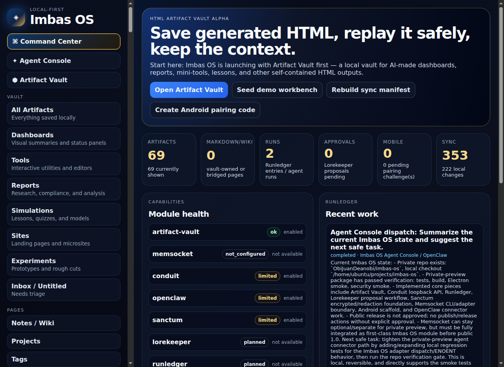

# Human-facing Artifact Vault shell

This is the implemented human-facing shell direction for Artifact Vault as it moves from a useful alpha into a product that feels like a real local-first workbench.

This screenshot is captured from the current local UI and replaces the earlier mockup as the design reference. The goal is to make the vault feel like an Obsidian/filesystem-style archive for AI-generated artifacts while keeping the AI-facing layer stable, indexed, and automatable.

## Product intent

The human-facing vault should answer five questions quickly:

1. **What do I have?** A navigable artifact library with filters and types.
2. **Where does it live?** A local vault tree with readable sections, projects, notes, and bundles.
3. **Can I trust it?** Visible sandbox/trust state, provenance, and source metadata.
4. **Can I reuse it?** Open, copy AI context, export, link, search, and snapshot actions.
5. **Is this local/private/portable?** Brand-level reminders that the user owns the vault.

## Shell structure

### 1. Branded app frame

- Imbas OS logo and app name at the top-left.
- Dark-tech + Celtic illuminated manuscript visual language.
- App-level actions remain quiet and secondary.
- The shell should feel premium and calm, not noisy or generic AI-gradient UI.

### 2. Left navigation

Primary sections:

- **Vault**
  - All Artifacts
  - Dashboards
  - Tools
  - Reports
  - Simulations
  - Sites
  - Experiments
  - Untitled / Inbox
- **Pages**
  - Notes
  - Projects
  - Tags
  - Runs
  - Graph
- **System**
  - Runs
  - Settings

Implementation note: artifact categories such as Dashboards, Tools, Reports, Simulations, Sites, and Experiments should start as smart filters over artifact metadata/tags/types, not hard-coded storage folders. The filesystem tree can stay human-readable while the UI provides useful filtered views.

### 3. Artifact list column

- Search artifacts.
- Sort by updated/created/title.
- Show title, type/project subtitle, icon/thumbnail/accent, and updated timestamp.
- Support empty, loading, error, and no-results states.
- Keyboard navigation should move through the list and update the preview/inspector.

### 4. Center artifact workspace

- Selected artifact title and tags.
- Safe preview or summary card of the artifact.
- Primary actions:
  - Open
  - Copy AI Context
  - Export
  - More actions
- Preview should never obscure sandbox/trust posture for generated HTML.

### 5. Right inspector

Tabs:

- **Details** — project, created/updated, model/provider, trust level, tags.
- **Notes** — editable human notes sidecar.
- **Provenance** — source path, prompt/request, imported/generated status, known/unknown origin facts.
- **Snapshots** — snapshot timeline, restore explanation, and reversible restore action.

The inspector should be backed by real artifact bundle data. Do not show fake provenance, fake run history, or fake model/provider values unless clearly marked as demo data.

### 6. Bottom value strip

Persistent launch-positioning reminders:

- Local First — your data stays on your machine.
- Private — no cloud, no tracking, no surprises.
- Portable — back up, move, take anywhere.
- Open Source — built in the open, for everyone.

This strip may collapse on narrow screens, but the values should remain visible in onboarding/about surfaces.

## Implementation slices

### M2.1 — Shell redesign

Status: implemented in the M2.1 shell slice.

- Adopt the branded three-pane shell: left nav, artifact list, center workspace, right inspector.
- Preserve current artifact operations.
- Add responsive behavior for narrow windows.
- Gate: a user can browse, select, preview, and inspect artifacts without losing existing functionality.

### M2.2 — Smart artifact taxonomy

- Add artifact type/category filters for dashboards, tools, reports, simulations, sites, and experiments.
- Store category/type in metadata where appropriate.
- Keep categories as views over metadata first; avoid locking storage to UI labels.
- Gate: imported/demo artifacts can be filtered by type and search still works.

### M2.3 — Inspector tabs

- Move details, notes, provenance, and snapshots into clear tabs.
- Keep edits persistent and searchable.
- Explain snapshot restore in place.
- Gate: all visible inspector fields are sourced from real metadata/notes/provenance/snapshot data.

### M2.4 — Human vault navigation

- Make Pages, Projects, Tags, and Graph visible as real or clearly staged sections.
- Runs should remain hidden, disabled, or private-preview-labelled until Runledger is public-ready.
- Gate: users can distinguish implemented sections from planned/private-preview sections.

### M2.5 — Polish and accessibility

- Keyboard navigation for search, artifact list, tabs, and primary actions.
- Focus states and labels.
- Empty/error/degraded states.
- Dark/light GitHub asset review where relevant.
- Gate: build/check pass and a screenshot or DOM inspection confirms the primary screen state.

## Alpha vs beta boundary

For public alpha, the app may keep a simpler UI if the core value is already honest and verified. This shell is the preferred beta direction and can be pulled into alpha only if it does not risk sandbox/security, import/export, snapshot, or context-export reliability.

Do not delay public alpha solely to implement every visual detail from the mockup. Do prioritize the right inspector structure, clear local/private/portable positioning, and human-readable vault direction because they materially improve product trust.
