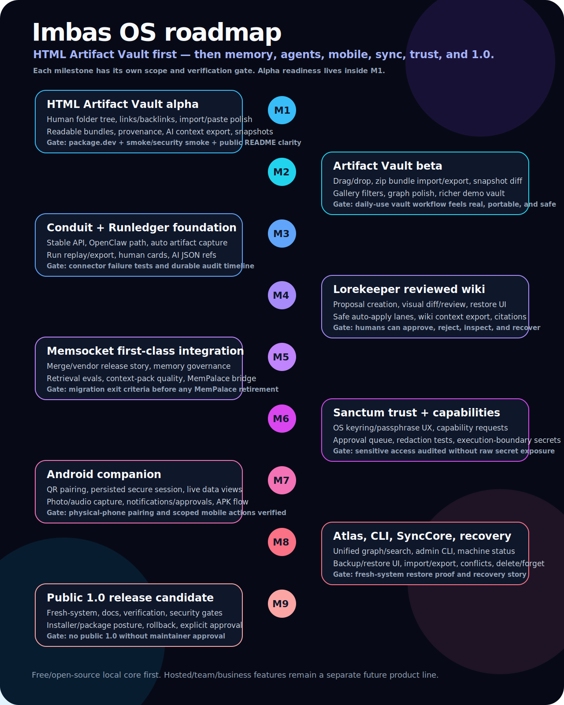

# Imbas OS public roadmap

This is the single source of truth for getting Imbas OS off the ground as free/open-source software.

The near-term wedge is **HTML Artifact Vault first**: make AI-generated HTML artifacts easy to save, inspect, replay, version, search, export, and share locally. The broader Imbas OS roadmap grows from that base into memory, wiki, agents, mobile, sync, trust, and team/cloud capabilities.

This roadmap is public-facing once the repository is made public, but it is still a plan, not a release promise. Public repository changes, public announcements, package publishing, hosted services, and paid offerings require explicit approval.

## North star

> AI work should not evaporate when the chat ends.

LLMs are moving from raw text to Markdown, HTML, interactive simulations, slides, dashboards, and eventually richer visual media. Imbas OS should be the local-first home where those outputs become durable, inspectable, searchable, reusable, and safe.

## External validation

Preserve this positioning anchor from Andrej Karpathy's X post:

> “This works really well btw, at the end of your query ask your LLM to \"structure your response as HTML\", then view the generated file in your browser.”

Karpathy's broader point: AI output is progressing from raw text to Markdown to HTML and onward to richer interactive visual media. That validates the HTML Artifact Vault wedge: generated interactive artifacts need a real home, not just a chat bubble or a downloads folder.

## Product architecture

Imbas OS has a dual-surface information architecture:

- **Human surface:** readable UI, docs, previews, review flows, visual diffs, provenance cards, undo/restore.
- **AI surface:** compact context, structured metadata, stable IDs, APIs, `llms` files, context packs, Runledger refs, policy/action contracts.

One source of truth, two first-class projections.

## Free/open-source strategy

The local core should be free/open-source and useful on its own.

Free local core includes:

- HTML Artifact Vault desktop app;
- local folder-based vault storage with a human-readable Obsidian-like tree;
- sandboxed replay for generated HTML;
- metadata, notes, provenance, snapshots, search, and export;
- docs and AI-readable project context;
- later: local memory, wiki, agent connectors, Runledger, Lorekeeper, Sanctum, and Android companion.

Paid offerings, if/when they happen, should be separate and should charge for hosted reliability, sync, collaboration, business controls, compliance, and managed services — not basic local ownership.

## Release state table

| State | Audience | What it means | What it must not imply |
|---|---|---|---|
| HTML Artifact Vault public alpha | Public OSS users after approval | A focused local desktop vault for generated HTML artifacts with sandbox replay, metadata/notes/provenance, snapshots, search, readable storage direction, and context export. | Full Imbas OS, production connector auth, hosted/cloud service, stable Android, or hardened automatic multi-agent capture. |
| Imbas OS private preview | Maintainer/dogfood users | Broader local-first agent OS integration work: Conduit, Runledger, Lorekeeper, Sanctum, Android, Memsocket adapters, OpenClaw dispatch, and migration experiments. | Public stability or public support commitments. |
| Imbas OS public 1.0 | Public release after gates pass | Coherent distribution with first-class modules, fresh-system proof, backup/restore/delete/forget, security/privacy review, and explicit maintainer approval. | A loosely related Artifact Vault app plus external memory tooling. |

## Release lanes

### Lane A: HTML Artifact Vault OSS alpha

Goal: publish a small, honest, useful free/open-source alpha centered on generated HTML artifacts.

Scope:

- Electron desktop app.
- Paste/import AI-generated HTML.
- Safe sandboxed replay.
- Local artifact bundles with `artifact.html`, `metadata.json`, `notes.md`, and snapshots.
- Metadata editing: title, project, tags, prompt, provider/model, trust level.
- Search across title/tags/notes/prompt/visible HTML.
- Notes, provenance, snapshot create/restore, and prompt-package/context export.
- A readable-storage path toward an Obsidian-like folder tree, with stable IDs/indexes underneath.
- Basic Markdown/artifact link and backlink foundations; deeper graph polish can move to beta if it threatens alpha focus.
- Demo artifacts and screenshots/GIFs.
- Root `README.md`, `llms.txt`, `llms-full.txt`, `AGENTS.md`, `skill.md`, `SECURITY.md`, `CONTRIBUTING.md`, license, roadmap.

Non-goals for alpha:

- Full Imbas OS 1.0.
- Production installer/signing/notarization.
- Hosted cloud service.
- Team/workspace features.
- Fully integrated Memsocket memory engine.
- Production-grade connector auth.
- Public claims that Android/OpenClaw live dispatch are stable.

Alpha success criteria:

- A new developer can clone, install, run, import an HTML artifact, place it in a human-readable folder tree, inspect metadata, create/restore snapshots, search, export a prompt package, and understand the security model.
- No secrets/private URLs/private user data are present.
- Security smoke proves untrusted HTML cannot access Node/Electron bridge and cannot make artifact-origin network requests by default.
- README makes the value obvious in under one minute.

### Lane B: Artifact Vault beta

Goal: make the HTML vault feel genuinely functional, not merely a demo.

Candidate work:

- Better first-run onboarding, including vault/folder tree orientation.
- Drag/drop import and paste polish.
- Gallery/list/detail UX improvements.
- Rich provenance cards.
- “Copy AI context” / “Export AI context pack” for artifacts.
- Zip import/export for portable bundles.
- Better snapshot diff/compare UX.
- Demo walkthrough video/GIF.
- More robust search filters and graph navigation.
- Optional browser-extension/share target research.
- More security tests around CSP, navigation, downloads, and local file boundaries.

Beta success criteria:

- The app is useful as a daily local vault for generated HTML artifacts.
- Users can safely move artifacts between machines.
- The human surface and AI surface both feel intentional.
- Links/backlinks make artifacts, Markdown, wiki knowledge, and later Memsocket context feel connected rather than separate.

### Lane C: Imbas OS private-preview integration

Goal: grow beyond artifact storage into the broader local-first agent OS while keeping Artifact Vault solid.

Subsystems:

- **Conduit:** stable local API/connector layer for OpenClaw first, then Hermes/Codex/Claude Code.
- **Runledger:** durable audit timeline for runs, actions, verification, and produced artifacts.
- **Lorekeeper:** reviewed wiki/proposal workflow with managed blocks, citations, snapshots, restore.
- **Memsocket:** memory/context engine, context events, search, retrieval, context packs.
- **Sanctum:** trust, redaction, approval policy, secret handles, capability scopes.
- **Atlas:** unified graph/search/navigation across artifacts, wiki, runs, memory, and projects.
- **SyncCore:** backup, restore, export/import, sync manifests, conflict detection, delete/forget propagation.
- **Android companion:** mobile capture, status, Runledger, Lorekeeper review, scoped approvals.
- **CLI:** automation/admin surface for humans and agents.

Private-preview success criteria:

- OpenClaw can save artifacts, write context events, retrieve context packs, create Lorekeeper proposals, and leave Runledger evidence.
- Humans can inspect, approve, reject, restore, and understand agent work.
- Android can pair and inspect useful live data.
- MemPalace remains available until Imbas/Memsocket migration criteria pass.

### Lane D: Imbas OS public 1.0

Goal: ship one coherent local-first Imbas OS distribution.

Required before public 1.0:

- Public 1.0 module coverage: Artifact Vault, Memsocket, Conduit, Runledger, Lorekeeper, Sanctum, Atlas, SyncCore, Desktop, Android/Mobile, and CLI each have a documented human surface, AI surface, source of truth, verification gate, and recovery/rollback story.
- Memsocket is fully merged/integrated/tested as a first-class Imbas OS module.
- Fresh-system gate passes from a clean environment.
- Documentation readiness gate passes.
- Backup/restore/delete/forget behavior is tested across memory, artifacts, wiki, and Runledger.
- Security/privacy audit passes.
- Public repo/license/release posture is approved.
- Johnathan explicitly approves public 1.0.

### Lane E: Hosted/team product later

Goal: keep the free local core trustworthy while eventually offering paid convenience and business-grade controls. This is explicitly after the local core is useful and should not block HTML Artifact Vault alpha.

Potential later scope:

- hosted sync and managed backup;
- browser-accessible workspace;
- team/org workspaces;
- shared review queues;
- admin controls and audit retention;
- compliance evidence exports;
- hosted connector infrastructure;
- managed agent runner options.

This lane is not Patreon. Patreon/supporter tiers may fund development and early access, but team/business operations should be a separate product line.

## GitHub roadmap milestones

These are intended to become GitHub milestones/issues once approved.

### M1 — HTML Artifact Vault alpha

Must-have before public alpha:

- [ ] Make first-run flow obvious.
- [ ] Polish paste/import flow, including a clear destination for new artifacts.
- [ ] Improve artifact detail page and metadata editing while keeping the filesystem bundle understandable.
- [ ] Add a clear provenance card or equivalent provenance panel.
- [ ] Add “Copy AI context” or artifact context-package export for the selected artifact.
- [ ] Improve snapshot browser and restore explanation.
- [x] Document artifact bundle file format.
- [x] Verify sandbox/security smoke.

Stretch/push-to-beta if needed:

- [ ] Make the human-facing vault an Obsidian-like folder tree with folders, nested folders, Markdown notes, and readable `.artifact/` bundles.
- [ ] Add Obsidian-style links, backlinks, unresolved-link reporting, and graph basics across notes/artifacts/wiki pages.
- [ ] Add deeper graph navigation using the shared reference model.

### M2 — HTML Artifact Vault beta

- [ ] Add drag/drop import.
- [ ] Add zip bundle import/export.
- [ ] Add snapshot diff/compare.
- [ ] Improve gallery/list filters.
- [ ] Add graph/backlink polish across nested Markdown folders and artifact bundles.
- [ ] Add richer demo vault.
- [ ] Add browser/share workflow research note.
- [ ] Add installation/package path decision.

### M3 — Conduit + Runledger foundation

- [ ] Stabilize Conduit local API contracts.
- [ ] Add automatic AI-generated artifact capture through Conduit with Runledger provenance and safe destination rules.
- [ ] Document connector protocol.
- [ ] Harden OpenClaw connector path.
- [ ] Add run replay/export improvements.
- [ ] Add richer Runledger human cards and AI JSON refs.
- [ ] Add connector failure-path tests.

### M4 — Lorekeeper reviewed wiki

- [ ] Improve proposal creation UX.
- [ ] Improve visual diff/review.
- [ ] Finish snapshot restore UI.
- [ ] Add safe auto-apply policy lanes for low-risk managed blocks.
- [ ] Add wiki context export.
- [ ] Add source/citation quality checks.

### M5 — Memsocket first-class integration

- [ ] Merge or vendor Memsocket into Imbas OS release story.
- [ ] Integrate Lorekeeper/wiki as the curated long-term knowledge source that indexes into Memsocket.
- [ ] Add memory/context event governance.
- [ ] Add retrieval eval fixtures.
- [ ] Add context pack quality tests.
- [ ] Add MemPalace migration/import/dogfood bridge.
- [ ] Pass migration exit criteria before MemPalace retirement.

### M6 — Sanctum trust and capabilities

- [ ] OS keyring/passphrase UX.
- [ ] Secret handle/capability request UX.
- [ ] Approval queue.
- [ ] Redaction policy tests.
- [ ] Connector execution-boundary secret resolution.
- [ ] Audit/export for sensitive access.

### M7 — Android companion

- [ ] Polish QR pairing.
- [ ] Validate persisted secure session on physical phone.
- [ ] Improve mobile Runledger/Lorekeeper views.
- [ ] Add photo/audio capture polish.
- [ ] Add notification/approval research.
- [ ] Document APK/install/update flow.

### M8 — Atlas, CLI, SyncCore, and recovery

- [ ] Unified Atlas search across artifacts, wiki pages, Memsocket context events/projections, runs, and projects.
- [ ] Graph/backlink navigation for artifacts, wiki, Runledger refs, and context packs.
- [ ] CLI/admin commands for verification, import/export, context-pack generation, backup/restore, and diagnostics.
- [ ] Machine-readable status output for automation and AI agents.
- [ ] Backup/restore UI.
- [ ] Portable export/import polish.
- [ ] Conflict detection UX.
- [ ] Delete/forget propagation.
- [ ] Fresh-system restore proof.

### M9 — Public 1.0 release candidate

- [ ] Run fresh-system gate.
- [ ] Run documentation readiness gate.
- [ ] Run full verification/security gate.
- [ ] Confirm public repo posture.
- [ ] Confirm installer/package plan.
- [ ] Confirm rollback/recovery plan.
- [ ] Obtain explicit Johnathan approval.

## Public alpha unveil assets

The repo should be prepared for a clean GitHub reveal before it is made public. Required visual/story assets:

- `docs/assets/brand/logo.svg` — full logo for README/header use.
- `docs/assets/brand/logo-mark.svg` — square icon/mark.
- `docs/assets/brand/logo-mark.png` — raster mark for surfaces that prefer PNG.
- `docs/assets/brand/social-card.png` — share/OpenGraph-style card.
- `docs/assets/demo/html-artifact-vault-preview.png` — static README hero preview.
- `docs/assets/demo/html-artifact-vault-flow.gif` — short animated flow demo.
- `docs/assets/roadmap/roadmap.svg` — roadmap graphic for README/docs/GitHub discussion.
- [`docs/release/public-alpha-unveil-checklist.md`](release/public-alpha-unveil-checklist.md) — repository presentation and final pre-public checklist.

Before public unveil, replace or supplement the generated concept demo with at least one real app screenshot/GIF captured from the alpha build. Keep generated concept art only if it accurately represents current behavior.

## Immediate next slice

Recommended next implementation slice:

1. Finish the remaining **M1 — HTML Artifact Vault alpha** UX work:
   - Obsidian-like human folder tree;
   - links, backlinks, and graph basics across notes/artifacts;
   - obvious first-run flow;
   - polished import/paste flow with folder destination;
   - clearer artifact detail + metadata editing;
   - provenance card;
   - “Copy AI context” and artifact context-pack export;
   - snapshot browser/restore explanation.
2. Re-run the alpha gate: docs check, tests, build, smoke/security smoke, and `npm run package:dev`.
3. Confirm GitHub README media renders well in dark/light.
4. Stop for approval before making the repo public or announcing anything.

## Approval boundaries

OpenClaw may prepare docs, code, tests, screenshots, packages, and checklists privately.

OpenClaw must not, without explicit approval:

- make the GitHub repo public;
- publish packages/binaries;
- post announcements;
- contact people;
- spend money;
- create hosted services;
- weaken sandbox/security controls;
- remove MemPalace;
- claim public 1.0 readiness.
